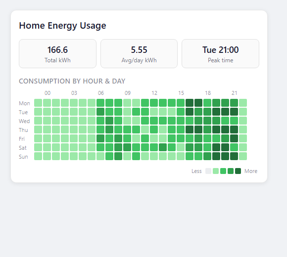

# 🟩 HA Energy Heatmap Card

[](https://hacs.xyz)
[](https://github.com/MacSiem/ha-energy-heatmap-card/releases)
[](https://opensource.org/licenses/MIT)

A custom Lovelace card for **Home Assistant** that visualizes energy consumption as a heatmap — like GitHub's contribution graph, but for your energy data.



## ✨ Features

- **Hour × Day Heatmap** — See exactly when you consume the most energy
- **Daily Overview Calendar** — GitHub-style contribution graph for daily totals
- **Peak Detection** — Automatically identifies your peak consumption times
- **Smart Stats** — Total consumption, daily average, peak time at a glance
- **6 Built-in Palettes** — Green, blue, orange, red, purple, yellow
- **Custom Colors** — Define your own gradient with hex colors
- **Dark Mode** — Follows your Home Assistant theme automatically
- **Interactive Tooltips** — Hover over any cell for exact values
- **Responsive Design** — Works on mobile, tablet, and desktop
- **HA Native** — Uses HA history API directly, no external dependencies

## 📦 Installation

### HACS (Recommended)

1. Open **HACS** in Home Assistant
2. Go to **Frontend** → Click **⋮** → **Custom repositories**
3. Add `https://github.com/MacSiem/ha-energy-heatmap-card` as **Lovelace** type
4. Search for **Energy Heatmap Card** and install
5. Refresh your browser

### Manual

1. Download `ha-energy-heatmap-card.js` from the [latest release](https://github.com/MacSiem/ha-energy-heatmap-card/releases)
2. Copy to `config/www/ha-energy-heatmap-card.js`
3. Add resource in **Settings** → **Dashboards** → **Resources**:
   - URL: `/local/ha-energy-heatmap-card.js`
   - Type: JavaScript Module

## 🚀 Usage

### Basic

```yaml
type: custom:ha-energy-heatmap-card
entity: sensor.energy_total
```

### Full Options

```yaml
type: custom:ha-energy-heatmap-card
entity: sensor.energy_total
title: Home Energy Usage
days: 30
palette: green
show_legend: true
show_labels: true
```

### Custom Colors

```yaml
type: custom:ha-energy-heatmap-card
entity: sensor.energy_total
title: Custom Gradient
min_color: "#fef0d9"
max_color: "#b30000"
```

### Per-Device Cards

```yaml
type: vertical-stack
cards:
  - type: custom:ha-energy-heatmap-card
    entity: sensor.plug_fridge_summation_delivered
    title: Fridge
    palette: blue
    days: 14
  - type: custom:ha-energy-heatmap-card
    entity: sensor.plug_washing_machine_summation_delivered
    title: Washing Machine
    palette: orange
    days: 14
```

## ⚙️ Configuration

| Option | Type | Default | Description |
|--------|------|---------|-------------|
| `entity` | string | **required** | Entity ID of your energy sensor (cumulative `kWh`) |
| `title` | string | `Energy Heatmap` | Card title (set to empty string to hide) |
| `days` | number | `30` | Number of days of history to display |
| `palette` | string | `green` | Color palette: `green`, `blue`, `orange`, `red`, `purple`, `yellow` |
| `show_legend` | boolean | `true` | Show the color scale legend |
| `show_labels` | boolean | `true` | Show hour and day-of-week labels |
| `unit` | string | auto | Override unit of measurement |
| `min_color` | string | — | Custom minimum color (hex, overrides palette) |
| `max_color` | string | — | Custom maximum color (hex, overrides palette) |

## 🎨 Color Palettes

| Palette | Preview |
|---------|---------|
| `green` | 🟩🟩🟩🟩 (default, GitHub-style) |
| `blue` | 🟦🟦🟦🟦 |
| `orange` | 🟧🟧🟧🟧 |
| `red` | 🟥🟥🟥🟥 |
| `purple` | 🟪🟪🟪🟪 |
| `yellow` | 🟨🟨🟨🟨 |

## 🔧 Supported Entities

This card works with any **cumulative energy sensor** (device_class: `energy`), including:

- Home Assistant Energy Dashboard entities
- Smart plugs (Zigbee, Z-Wave, WiFi)
- Utility meter sensors
- Shelly, Sonoff, IKEA, Aqara energy sensors
- Any sensor that reports cumulative `kWh`

## 🤝 Contributing

Contributions are welcome! Please:

1. Fork the repository
2. Create a feature branch (`git checkout -b feature/amazing-feature`)
3. Commit your changes (`git commit -m 'Add amazing feature'`)
4. Push to the branch (`git push origin feature/amazing-feature`)
5. Open a Pull Request

## 📄 License

This project is licensed under the MIT License — see the [LICENSE](LICENSE) file for details.

## 💡 Inspiration

This card was built out of a need to understand **when** energy is consumed, not just **how much**. Standard HA energy dashboards show totals and trends, but miss the hour-by-hour patterns that reveal standby waste, peak usage habits, and optimization opportunities.

---

**Made with ❤️ for the Home Assistant community**

---

## Support

If you find this project useful, consider supporting its development:

<a href="https://buymeacoffee.com/macsiem" target="_blank"></a>
<a href="https://www.paypal.com/donate/?hosted_button_id=Y967H4PLRBN8W" target="_blank"></a>
